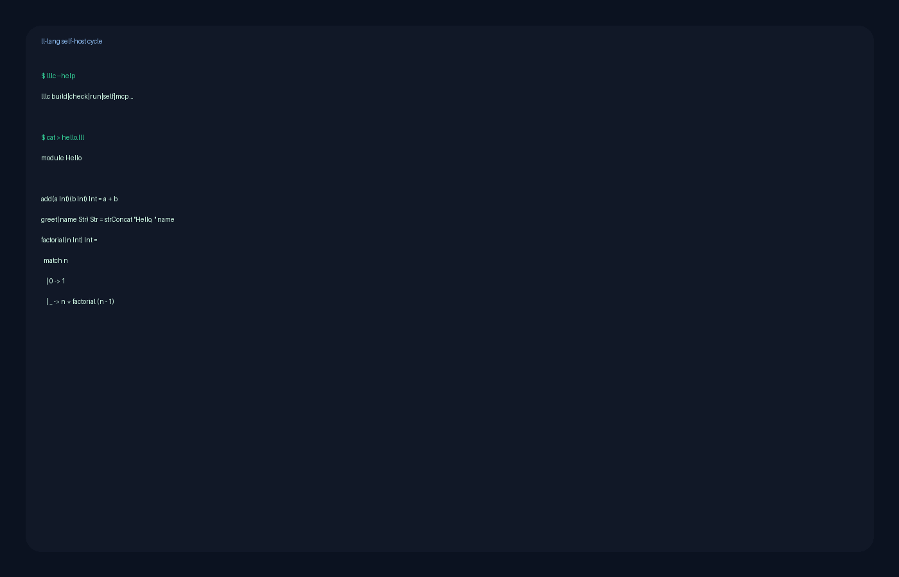

  <section class="ll-hero">
    

      
      
Statically-typed functional language for LLM code generation

      <h1>Give language models less syntax to waste.</h1>
      

        ll-lang keeps prompts compact, catches mistakes before execution, and
        returns diagnostics an agent can repair without parsing human prose.
      

      

        <a class="md-button md-button--primary" href="https://github.com/Neftedollar/ll-lang">Open GitHub</a>
        <a class="md-button" href="https://dev.to/neftedollar/the-2600-line-compiler-that-compiles-itself-and-emits-f-typescript-python-java-and-c-49lh">See it in action</a>
        <a class="md-button" href="why-ll-lang/">Why ll-lang</a>
        <a class="md-button" href="language-spec/">Read the spec</a>
        <a class="md-button" href="https://github.com/Neftedollar/ll-lang/discussions">Leave beta feedback →</a>
      

      

        

          8–17%
          smaller than F# on measured code
        

        

          1.3–5.9x
          more compact than TS, Python, and Java on type-heavy samples
        

        

          30
          MCP tools exposed by <code>lllc mcp</code>
        

      

    

    

      
      

        Same benchmark sample, side by side: 142 TypeScript tokens versus 110 ll-lang tokens.
      

    

  </section>

  <section class="ll-command-bar">
    Install a pinned bootstrap compiler
    <code>./tools/bootstrap-self.sh install</code>
  </section>

  <section class="ll-section ll-section--contrast">
    

      
See it in action

      <h2>A full self-host cycle now has a working demo.</h2>
      

        The latest walkthrough shows one compact ll-lang source file compiling to
        multiple targets, then the compiler checking its own source in the
        self-hosted path.
      

      

        <a href="https://dev.to/neftedollar/the-2600-line-compiler-that-compiles-itself-and-emits-f-typescript-python-java-and-c-49lh">Read the dev.to post</a>
        <a href="https://github.com/Neftedollar/ll-lang/blob/main/tools/demo-self-host.sh">Open demo script</a>
      

    

    

      
      

        Roughly 24 seconds: install, compile to TypeScript and Python, then run the self-host check.
      

    

  </section>

  <section class="ll-section">
    
Why ll-lang

    <h2>Built for the feedback loop LLMs actually live in.</h2>
    

      <article class="ll-card">
        <h3>Smaller prompts, same logic</h3>
        

          Less punctuation and ceremony means more of the context window goes to
          intent, types, and behavior.
        

      </article>
      <article class="ll-card">
        <h3>Compile before you execute</h3>
        

          Hindley-Milner inference, tagged values, and exhaustive matches move
          bugs into the compiler instead of production logs.
        

      </article>
      <article class="ll-card">
        <h3>Diagnostics models can repair</h3>
        

          Error codes stay single-line and structured, so agents can fix one
          concrete issue at a time.
        

      </article>
    

  </section>

  <section class="ll-section ll-section--contrast">
    

      
Live snippet

      <h2>The “hello world” path stays short.</h2>
      

        The language surface is compact enough for quick prompting, but it still
        compiles to real targets and ships with a built-in MCP server.
      

      

        <a href="https://github.com/Neftedollar/ll-lang/blob/main/README.md">README</a>
        <a href="language-spec/">Spec</a>
        <a href="playground/">Playground status</a>
      

    

    

      <pre><code class="language-lll">module Hello

Hello = printfn "Hello, ll-lang!"</code></pre>
      <pre><code class="language-bash">./tools/lllc-bootstrap.sh run hello.lll
# Hello, ll-lang!</code></pre>
    

  </section>

  <section class="ll-section">
    
Proof points

    <h2>Not a toy syntax demo.</h2>
    

      <article class="ll-proof">
        <h3>Self-hosting compiler</h3>
        

          ll-lang compiles itself. The bootstrap compiler reaches a fixpoint:
          <code>compiler₁.fs == compiler₂.fs</code>.
        

      </article>
      <article class="ll-proof">
        <h3>Multi-target output</h3>
        

          One source can emit F#, TypeScript, Python, Java, C#, and an
          experimental LLVM backend.
        

      </article>
      <article class="ll-proof">
        <h3>Real tooling surface</h3>
        

          <code>lllc mcp</code> exposes compile, diagnose, symbol, fix-preview,
          and project graph tools for editor agents.
        

      </article>
      <article class="ll-proof">
        <h3>Docs stay close to the metal</h3>
        

          The landing page pushes deeper reading into the README, user guide,
          spec, and compiler internals instead of duplicating them.
        

      </article>
    

  </section>

